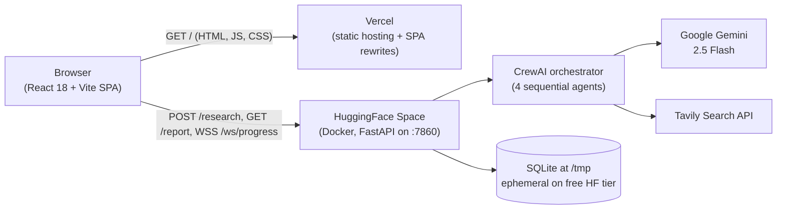
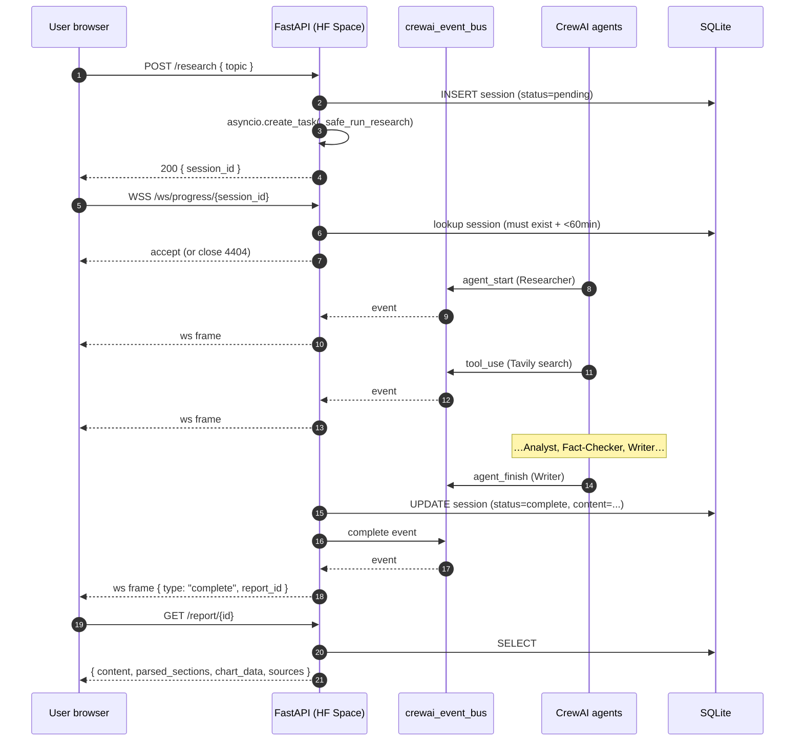

# Architecture

This document describes how the Multi-Agent Research Pipeline is structured,
how a research request flows through the system, and what trade-offs were
made when picking each component.

## High-level topology

- **Frontend** is a pure SPA. Vercel serves it statically and rewrites every
  unknown path back to `index.html` so client-side routing works
  (`/report/:id` deep links).
- **Backend** lives on a HuggingFace Space (Docker, public, free CPU tier).
  All API + WebSocket traffic goes there over `https://` / `wss://`.
- **State** is intentionally minimal — a single `sessions` table with the
  topic, status, report markdown, and timestamps. No user accounts.

## Request lifecycle

Key points:

1. The HTTP request returns immediately with a `session_id`. Long-running
   work happens in an `asyncio.create_task` wrapped by `_safe_run_research`
   which catches `BaseException` so a crash inside CrewAI always marks the
   session as `failed` rather than leaving it in `running` forever.
2. Progress streams over a WebSocket bound to the session id. The WS
   handler validates the session id against the DB on connect and closes
   with code `4404` for unknown / expired ids.
3. The Writer agent is prompt-constrained to produce strict markdown
   (`## Section`, `Confidence: NN%`, final `## Sources` block). The server
   parses that markdown once at fetch time so the frontend never has to
   reparse on every render.
4. PDFs are rendered server-side with `markdown-it-py` → styled HTML →
   WeasyPrint, with a pure-SVG confidence bar chart inlined (no
   matplotlib).

## Why these choices

| Concern | Choice | Why |
|---|---|---|
| Multi-agent orchestration | CrewAI sequential process | Native event bus, easy progress streaming, no LangGraph-style ceremony |
| LLM | Gemini 2.5 Flash via `crewai.LLM` | Cheap, fast, large context, generous free tier |
| Search | Tavily | Purpose-built for LLMs, returns clean snippets |
| Backend host | HF Spaces (Docker) | Free CPU + WSS + Python; no Vercel cold-start pain |
| Frontend host | Vercel | Free static + edge cache; great DX |
| Streaming | Raw `WebSocket` + JSON frames | Simpler than SSE-with-reconnect; fine for a single-page session |
| DB | SQLite at `/tmp` on HF, Postgres locally via `db.adapter` | Zero setup on HF; richer dev experience locally |
| PDF | WeasyPrint + inline SVG | One library, no headless Chromium, deterministic output |
| Rate limiting | `slowapi` | Per-IP, in-memory, no Redis dependency |

## Known limitations

- **Ephemeral DB**: `/tmp` on a free HF Space is wiped on container restart.
  History will disappear periodically. Persistent storage requires a paid
  Space or an external Postgres URL.
- **No auth**: anyone with the URL can run research. Rate limiting and
  input validation cap abuse but don't replace authentication.
- **Single-process worker**: each session runs in the same uvicorn worker.
  At free-tier scale this is fine; for sustained throughput, move CrewAI
  to a worker queue (RQ / Celery / Cloud Tasks).
- **WS session binding window**: 60 minutes. Long enough that a slow
  research run doesn't get disconnected, short enough that stale session
  ids can't be replayed forever.

## Related files

- `backend/main.py` — FastAPI app, CORS, security headers, rate limiter
- `backend/api/research.py` — REST endpoints, input validation, PDF route
- `backend/api/websocket.py` — WS handler with session-id binding
- `backend/api/report_parser.py` — markdown → sections + chart + PDF HTML
- `backend/crew/crew.py` — CrewAI assembly
- `backend/crew/callbacks.py` — `ProgressListener` bridge to WS
- `frontend/src/hooks/useResearch.js` — POST + WS state machine
- `frontend/src/App.jsx` — routes, mobile drawer, live dashboard
